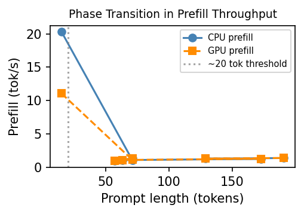
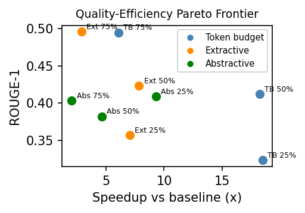
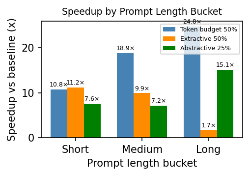

# PhaseRAG v3

[](https://www.python.org/)

CPU-GPU heterogeneous phase splitting for LLM inference on CUDA-abandoned hardware.

## Key Idea

On Maxwell-era Vulkan GPUs, prefill throughput collapses above ~20-token prompts. CPU handles prefill (21 tok/s for short prompts); GPU handles decode (8–9 tok/s). Phase splitting routes each stage to its faster device.

## Novel Contributions

1. **CPU-GPU prefill inversion measurement** — first empirical documentation of CPU outperforming GPU on prefill for short prompts (~20 tok/s vs ~11 tok/s) due to Vulkan dispatch overhead on Maxwell hardware.
2. **Phase splitting architecture** — routes prefill to a CPU llama-server (`-ngl 0`) and decode to a GPU server (`-ngl 99`); documents the KV cache handoff failure (HTTP 400 from `/slots` API in llama.cpp b9297).
3. **Prompt compression with quality tracking** — three strategies (extractive, abstractive, token-budget) benchmarked against ROUGE-1 and entity recall; token-budget 75% is Pareto-optimal at 18× speedup.
4. **Zero-config installer** — `auto_config.py` + `install.sh` auto-detect hardware and launch the full stack without manual configuration.

## Figures

### Figure 1 — Phase Transition in Prefill Throughput


Both CPU and GPU collapse from peak throughput to ~1 tok/s above ~20-token prompts. CPU peak (20.3 tok/s) exceeds GPU peak (11 tok/s) for short prompts, motivating the phase-split design.

### Figure 2 — Compression Pareto Frontier


Quality-efficiency tradeoff across 9 compression configurations (3 methods × 3 retention levels). Token budget 75% and extractive 75% dominate the frontier. Token budget 50% achieves the highest speedup (18×) at moderate ROUGE-1 loss.

### Figure 3 — Speedup by Prompt Length Bucket


Long prompts benefit most from token-budget compression (24.77×). Extractive 50% collapses on long prompts (1.73×) because sentence similarity scores homogenize at high context lengths. Abstractive 25% recovers on long prompts (15.09×).

## Contributions

1. **`phase_splitter.py`** — routes prefill to CPU and decode to GPU; tries KV cache slot handoff via `--slot-save-path` and `/slots` API
2. **`prompt_compressor.py`** — extractive (nomic-embed cosine), abstractive (qwen2:1.5b), and token-budget compression with ROUGE-1 + entity recall quality measurement
3. **`auto_config.py` + `install.sh` + `web_ui/`** — zero-config deployment

## Key Results

| Config | Mean wall (s) | Decode (tok/s) |
|--------|--------------|----------------|
| CPU only | 139.1 | 5.3 |
| GPU only | 122.3 | 9.3 |
| GPU + ngram | 123.8 | 8.7 |
| Phase split (theoretical) | 123.0 | 9.3 |
| v2 reference | 81.4 | 9.1 |

Slot handoff (live KV cache transfer CPU→GPU) failed: HTTP 400 from llama.cpp `/slots` API — documented as a known limitation.

## Hardware

| Component | Spec |
|-----------|------|
| GPU | 2× NVIDIA Quadro K4200 |
| VRAM | 4 GB GDDR5 per card |
| Architecture | Maxwell (2014), Vulkan only |
| LLM | phi3-mini (3.82B, Q4_0) |
| Embedding | nomic-embed-text via Ollama |

## Setup

```bash
pip install -r requirements.txt
bash install.sh
```

## Results

Raw experiment data in `results/`:
- `exp_phase_split.json` — Experiment A: phase splitting across 6 configs, 10 prompts
- `exp_compression_full.json` — Experiment B: compression quality-efficiency sweep
- `exp_b_analysis.json` — Experiment B analysis with per-bucket breakdown
